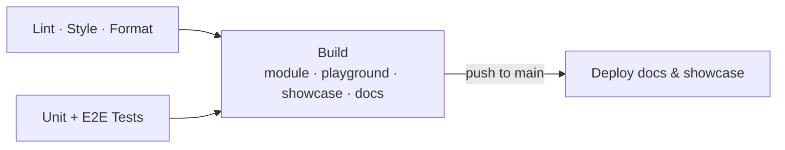

<a href="https://nuxt-compose-icons.dev" >

</a>

# Nuxt-Compose-Icons

<p>
  <a href="https://npmjs.com/package/nuxt-compose-icons"></a>
  <a href="https://npmjs.com/package/nuxt-compose-icons"></a>
  <a href="https://npmjs.com/package/nuxt-compose-icons"></a>
  <a href="https://github.com/arthu-pr/nuxt-compose-icons/actions"></a>
  <a href="https://packagephobia.com/result?p=nuxt-compose-icons"></a>
  
  
  <a href="LICENSE"></a>
</p>

<details>
<summary>CI coverage</summary>

CI gates every PR on unit + e2e tests, lint, and a full build (module, playground, showcase, docs) across Node 22 & 24 — not just formatting. → [Latest run](https://github.com/arthu-pr/nuxt-compose-icons/actions/workflows/ci.yml)



</details>

This module generates fully customizable Vue components from your initial raw SVG files at build time, and gives you:

- 🧩 The flexibility of raw SVG
- 🎨 Theming control:
  - At build time via configuration
  - At runtime via CSS variables
- 🏔 ️Native Nuxt auto-import support

For building design systems or simply use in-house icons.

 
**Used in production at [reteach](https://www.reteach.com/)**

## 📦 Installation

```bash
pnpm add nuxt-compose-icons
```

```bash
npm install nuxt-compose-icons
```

```bash
yarn add nuxt-compose-icons
```

## 🛠 Quick start

**1. Add to `nuxt.config.ts`:**

```ts
export default defineNuxtConfig({
  modules: ['nuxt-compose-icons'],
  composeIcons: {
    pathToIcons: './assets/icons',
  },
});
```

**2. Drop your SVGs in `./assets/icons`**

**3. Use them anywhere — no imports needed:**

```vue
<template>
  <ArrowUpIcon size="md" color="var(--primary)" />
  <UserBadgeIcon size="lg" fill="currentColor" />
</template>
```

That's it. Every `.svg` becomes a typed, auto-imported Vue component.

## 🎯 Motivation

Existing icon solutions often force trade-offs between DX, accessibility, and flexibility:

1. **Third-party libraries** → limited customization
2. **Manual Vue components** → repetitive and hard to scale
3. **SVG loaders** → flexible but lack structure and typing

| Feature                | Third-party Libraries        | Manual Vue Components | SVG Loaders (`vite-svg-loader`) | **Nuxt Compose Icons**      |
| ---------------------- | ---------------------------- | --------------------- | ------------------------------- | --------------------------- |
| **Setup**              | ✅ Easy                      | ⚠️ Manual             | ⚠️ Requires config              | ✅ Minimal                  |
| **Source of truth**    | External package             | Vue files             | SVG files                       | SVG files                   |
| **SVG output**         | Clean (often wrapped)        | Custom                | Inline                          | Clean, no wrappers          |
| **SVG control**        | Often abstracted             | ✅ Full               | ✅ Full                         | ✅ Full                     |
| **Theming**            | ⚠️ Prop-based, limited       | ✅ Manual CSS         | ✅ CSS-based                    | ✅ CSS variables + props    |
| **Naming consistency** | Library-defined              | Developer-defined     | File-based                      | Deterministic, file-based   |
| **Typing**             | ✅ Provided                  | ✅ Manual             | Depends on setup                | ✅ Generated & inferred     |
| **Scaling**            | Dependent on library updates | Maintenance-heavy     | Flexible but unstructured       | Structured, build-generated |
| **Nuxt integration**   | ✅ Works                     | ✅ Auto-importable    | ⚠️ Requires configuration       | ✅ Native auto-import       |

`@nuxt/icon` is the most common example of the "Third-party Libraries" column above.
[`nuxt-icons`](https://github.com/gitFoxCode/nuxt-icons) doesn't fit that column — it's
bring-your-own-SVG like this module — but it's a runtime name-lookup (`<nuxt-icon name="..." />`
injecting SVG markup at render time) rather than generating standalone components, so it lands
on the same side of that specific distinction as `@nuxt/icon`.

Nuxt also has an excellent official icon module, [`@nuxt/icon`](https://github.com/nuxt/icon) — for a huge, ready-made icon set with zero setup, use it. This module solves a different problem: turning **your own** SVG files into **standalone, ownable Vue components**, for a design system or an in-house icon library, without the trade-offs above.

→ [How this compares to `@nuxt/icon`](https://nuxt-compose-icons.dev/guide/features#how-this-compares-to-nuxt-icon) · [Common Approaches](https://nuxt-compose-icons.dev/guide/concept#common-approaches)

## Features

- **SVG to Vue Component at build time** — one component per `.svg` file, named in PascalCase or kebab-case with optional prefix/suffix
- **Auto-registered in Nuxt** — no manual imports, type-safe usage in `<template>`
- **No wrappers** — the component root is a single `<svg>` element, original attributes preserved
- **Theming via CSS Custom Properties** — `fill`, `stroke`, `stroke-width` become `var(--icon-*, original)`, overridable via props, cascading styles, or scoped CSS
- **Developer Experience** — full autocompletion/type-checking, and Vue DevTools support since generated icons are real components

```xml
<!-- Input: user-badge.svg -->
<svg fill="#000" stroke="#fff" stroke-width="2">
  <path d="..." />
</svg>
```

```vue
<!-- Output: UserBadgeIcon.vue -->
<template>
  <svg
    fill="var(--icon-fill, #000)"
    stroke="var(--icon-stroke, #fff)"
    stroke-width="var(--icon-stroke-width, 2)"
  >
    <path d="..." />
  </svg>
</template>
```

```vue
<!-- Theme it -->
<template>
  <UserBadgeIcon stroke="blue" fill="red" size="lg" />
</template>
```

→ [Full feature list with examples](https://nuxt-compose-icons.dev/guide/features)

## Own your components

Each icon is a real, standalone Vue component — not a runtime lookup like `@nuxt/icon`'s `<Icon name="my:user-badge" />` or `nuxt-icons`' `<nuxt-icon name="user-badge" />`. That distinction matters once icons need to live outside a single Nuxt app:

- The generated `.vue`/`.ts` files are committed to your repo, versioned like any other component
- A UI library can ship `<UserBadgeIcon />` directly — apps that consume the UI library never install or configure `nuxt-compose-icons` themselves (the UI library still does, as a normal dependency, since the generated components import from it)
- Set `component.destDir` and a `compose-icons.css` file is generated alongside the components, with your project's actual theme baked in — commit both, and that's everything a downstream consumer needs for full theming
- Add `component.hasIndexFile: true` for an `index.ts` barrel that re-exports every icon — one import for the whole set
- Add a new icon, rebuild — no separate publish/sync step to keep a design system's icon set current

→ [Monorepo guide](https://nuxt-compose-icons.dev/guide/monorepo) — with a live example repo (Nx + pnpm)

<a href="https://nuxt-compose-icons.dev/guide/monorepo">

</a>

## 📖 Documentation

Full documentation and advanced configuration:

👉 [https://nuxt-compose-icons.dev](https://nuxt-compose-icons.dev/)

## ▶️ Try it

[](https://stackblitz.com/fork/github/arthu-pr/nuxt-compose-icons/tree/main/examples/runtime-showcase)

## 🗺 Roadmap

👉 [GitHub Projects](https://github.com/users/arthu-pr/projects/7/views/1)
